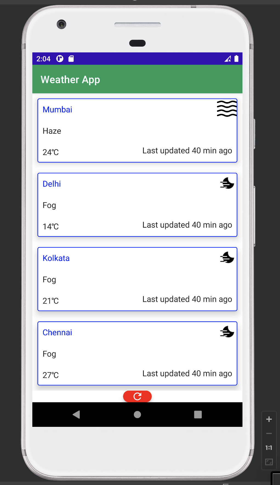
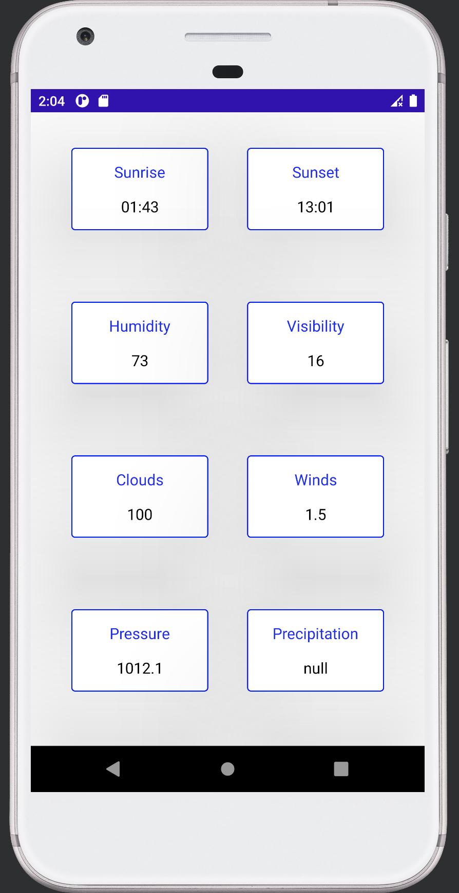
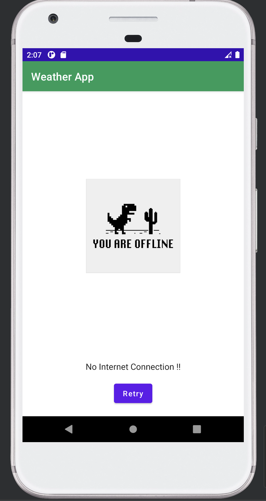

## Topics covered in the assignment :

1. MVVM
2. Retrofit
3. Jetpack Compose
4. Realm

This app displays the wetaher information of the 4 metro cities of India, using API call to api.weatherbit.io. App supports 100 percent offline mode. The states of network and database have been handled in this way :

1. Cache empty and no network connection - Error Screen
2. Cache has data, but no network connection - Load Data From Cace
3. There is network connection - Fetch Data From API irrespective of Cache status.

For every city, the following information is displyed :

1. Temperature
2. Weather Description
3. An icon of the weather mapped with respect to an icon code coming from the API.
4. Duration before which last observation of weather data was taken (Current Time - Last Observation Time)
5. Sunrise Time in GMT
6. Sunset Time in GMT
7. Humidity Percentage
8. Visibility Percentage
9. Cloud coverage Percentage
10. Wind Sped in km/hr
11. Pressure in milibar

MVVM architecture has been used for the organisation of the code, along with a Repository folder which calls The Network class or DB class as per the network status.

Video link of the working app :

[Google Drive Link](https://drive.google.com/file/d/1rI1enyMgG9QFts7umFKA2obPXssv-dXp/view?usp=sharing)

# Weather_Android_Application

## Home Screen UI

## Detail Screen UI

## Error Screen UI 

